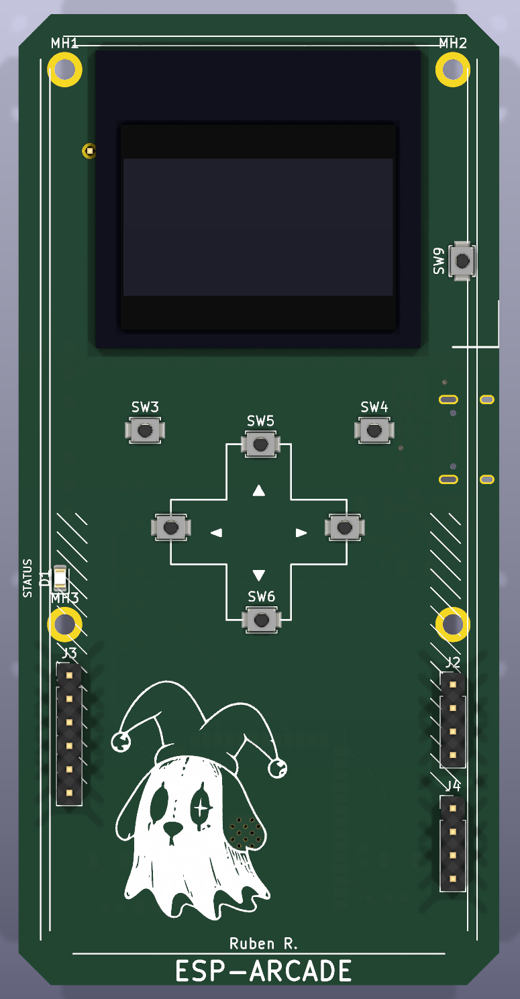
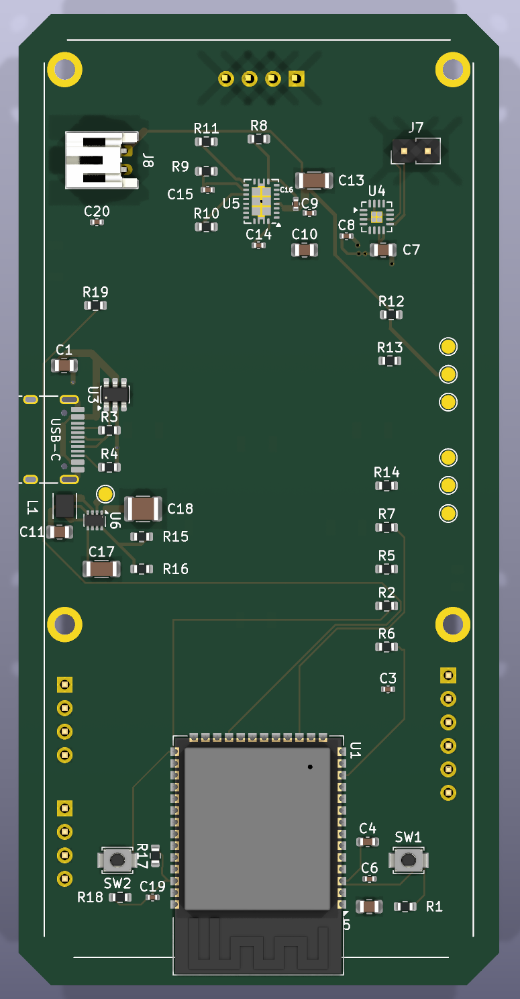

# ESP-ARCADE-32

# ESPARCADE Firmware Architecture (ESP32 / ESP32-S3)

## Overview

ESPARCADE is a modular handheld gaming console firmware built on **ESP32** (compatible with ESP32-S3 and classic ESP32-DEVKIT-C), designed with scalability, maintainability, and portability in mind.

The firmware follows a layered architecture to separate:

- Hardware abstraction (drivers)
- System services (WiFi, OTA)
- Core engine logic (state machine)
- User interface (menu, keyboard, config)
- Games

This allows:

- SH1106 / SSD1306 OLED display compatibility (I²C, 128×64)
- Modular game integration
- OTA firmware updates via GitHub Releases
- WiFi credential management with on-device virtual keyboard
- Wokwi simulation support
- Easy scalability for future hardware revisions

---

# System Architecture

```txt
+--------------------------------------------------+
|                    APPLICATION                   |
|--------------------------------------------------|
| Snake | Pong | Flappy Bird | Tetris (placeholder) |
+--------------------------------------------------+

+--------------------------------------------------+
|                    CORE ENGINE                   |
|--------------------------------------------------|
| SystemManager (state machine)                    |
| MenuS (reusable generic menu)                    |
| Input driver                                     |
+--------------------------------------------------+

+--------------------------------------------------+
|                    SYSTEM SERVICES               |
|--------------------------------------------------|
| WiFiService  (connection + NVS persistence)      |
| OTAService   (GitHub Releases OTA update)        |
+--------------------------------------------------+

+--------------------------------------------------+
|                 HARDWARE ABSTRACTION             |
|--------------------------------------------------|
| Display Driver  (U8g2, SH1106/SSD1306 I2C)      |
| Input Driver    (6 push-buttons)                 |
| Time Driver     (millis wrapper)                 |
+--------------------------------------------------+

+--------------------------------------------------+
|                     HARDWARE                     |
|--------------------------------------------------|
| ESP32 / ESP32-S3                                 |
| SH1106 OLED 128×64 (I2C: SDA=21, SCL=22)        |
| 6× Push-buttons (OK, BACK, UP, DOWN, LEFT, RIGHT)|
| USB-C (power + programming)                      |
+--------------------------------------------------+
```

---

# Project Structure

```txt
ESP-ARCADE/
│
├── diagram.json              ← Wokwi hardware wiring diagram
├── platformio.ini            ← PlatformIO build config (esp32-s3-devkitc-1 + esp32dev)
├── wokwi.toml                ← Wokwi simulation config + scenarios
├── README.md
│
├── src/
│   ├── main.cpp              ← Entry point: creates SystemManager, calls begin()/update()
│   │
│   ├── config/
│   │   ├── display_config.h  ← Display controller selection (SH1106/SSD1306), I2C pins, resolution
│   │   └── pins.h            ← Button GPIO definitions
│   │
│   ├── core/
│   │   ├── system_manager.h  ← SystemManager class + State enum
│   │   └── system_manager.cpp← Main state machine: MENU, SNAKE, PONG, TETRIS, CONFIG,
│   │                            BIRD, WIFI_CONFIG, UPDATE_CONFIG, INFO
│   │
│   ├── core0/
│   │   └── services/
│   │       ├── wifi_service.h / .cpp   ← WiFiService: connect, scan, NVS persistence,
│   │       │                             background FreeRTOS task, OTA check integration
│   │       └── ota/
│   │           ├── OTA.h / .cpp        ← OTAService: GitHub Releases version check,
│   │                                     HTTPS firmware download, NVS version storage
│   │
│   ├── drivers/
│   │   ├── display/
│   │   │   ├── display.h               ← Display API: InitDisplay, ClearDisplay, DrawText,
│   │   │   └── display.cpp               DrawBitmap, DrawLogo, DrawMenu, ActDisplay,
│   │   │                                 DrawBox, SetCustomFont (SMALL/MEDIUM/LARGE)
│   │   ├── input/
│   │   │   ├── buttons.h               ← Input class + isPressed(), input extern instance
│   │   │   └── buttons.cpp             ← Debounce logic, realDirection()
│   │   └── time/
│   │       ├── millis.h
│   │       └── millis.cpp              ← millis() abstraction wrapper
│   │
│   ├── assets/
│   │   └── images/
│   │       ├── assets.h / .cpp         ← Asset includes
│   │       ├── logo.h                  ← Boot logo bitmap (PROGMEM)
│   │       └── pong_images/
│   │           ├── pong_win.h          ← Win screen bitmap
│   │           ├── pong_lose.h         ← Lose screen bitmap
│   │           ├── scoreboard.h
│   │           └── scoreboard.cpp      ← Score display logic
│   │
│   ├── games/
│   │   ├── snake/
│   │   │   ├── Snake.h                 ← Snake: max 50 segments, states (INIT/START/GAME_OVER/AGAIN)
│   │   │   └── Snake.cpp
│   │   ├── pong/
│   │   │   ├── pong.h                  ← Pong: player vs AI, ball physics, win/lose screens
│   │   │   └── pong.cpp
│   │   └── pruebas/
│   │       ├── pruebas.h               ← Flappy Bird: Pajaro + Pipe classes, collision detection
│   │       └── pruebas.cpp
│   │
│   └── ui/
│       ├── menu.h / menu.cpp           ← Main menu: render, update, confirm, back, index
│       ├── keyboard.h / keyboard.cpp   ← VirtualKeyboard: 3 modes (lowercase/uppercase/numbers)
│       │                                 30-char grid, word input for WiFi passwords
│       └── config/
│           ├── config_menu.h / .cpp    ← MenuS: reusable generic submenu (options + cursor)
│           ├── WiFi/
│           │   ├── wifi_display.h      ← WifiMenu: scan → select → password → connect flow
│           │   └── wifi_display.cpp      States: SCANNING, SELECT_NETWORK, ENTER_PASSWORD,
│           │                                     CONNECTING, CONNECTION_FAILED
│           └── update/
│               ├── update.h            ← UpdateMenu: wraps OTAService for UI-triggered update
│               └── update.cpp
│
└── test/
    ├── README
    └── test_menu.cpp
```

---

# Hardware Configuration

## Pin Mapping

| Function  | GPIO |
| --------- | ---- |
| BTN_OK    | 4    |
| BTN_BACK  | 19   |
| BTN_UP    | 17   |
| BTN_DOWN  | 32   |
| BTN_LEFT  | 12   |
| BTN_RIGHT | 13   |

## Display (I²C OLED)

| Parameter   | Value                      |
| ----------- | -------------------------- |
| Controller  | SH1106 (default) / SSD1306 |
| Resolution  | 128 × 64 px                |
| I²C SDA     | GPIO 21                    |
| I²C SCL     | GPIO 22                    |
| I²C Address | 0x3C                       |
| Reset Pin   | -1 (none)                  |

> Switch display controller in `src/config/display_config.h` by changing `DISPLAY_CONTROLLER`.

## Libraries

| Library     | Version  | Use                           |
| ----------- | -------- | ----------------------------- |
| U8g2        | ^2.35.19 | OLED display driver           |
| ArduinoJson | ^6.20.0  | GitHub API JSON parsing (OTA) |

---

# Custom PCB (ESP-ARCADE Rev B)

Besides the firmware, ESPARCADE has its own handheld board designed in **KiCad 10**: a 4-layer, 52 × 105 mm PCB (F.Cu / PWR / GND / B.Cu) built around an **ESP32-S3-WROOM-1** module, with the OLED and the controls on the front and the module and power electronics on the back.

<p align="center">
  
</p>

<p align="center"><em>3D render — front side (OLED, D-pad, buttons) and back side (ESP32-S3, power, audio).</em></p>

## Board Features

| Block         | Part                          | Notes                                                        |
| ------------- | ----------------------------- | ------------------------------------------------------------ |
| MCU           | ESP32-S3-WROOM-1              | Wi-Fi + BLE, native USB, PCB antenna at the board edge       |
| USB input     | USB-C receptacle + USBLC6-2SC6 | 5.1 kΩ CC pull-downs, ESD protection on D+/D-                |
| Battery       | BQ24070 + JST-PH connector    | 1S LiPo charger with power-path (`SYS`), status/PG signals to the MCU |
| 3V3 rail      | TPS631000 buck-boost + 1 µH   | Keeps 3V3 stable while the battery discharges                |
| Audio         | MAX98357A (I²S class-D amp)   | 2-pin speaker header, `SD_MODE` controlled by the MCU        |
| Display       | 1.3" 128×64 OLED (I²C)        | 4-pin header, 4.7 kΩ pull-ups                                |
| Controls      | 6 tactile buttons + RESET / BOOT / POWER | D-pad, SELECT and BACK                            |
| Battery gauge | 1 MΩ / 1 MΩ divider → ADC1    | `VBAT_SENSE` on GPIO2                                        |
| Expansion     | I²C, GPIO (IO4–IO7) and UART headers | Test points on VBUS, SYS, BAT+, 3V3, GND, LX2         |

<p align="center">
  
  
</p>

## Schematic

<p align="center">
  
</p>

## PCB Pin Mapping (ESP32-S3)

| Function       | GPIO | Function        | GPIO |
| -------------- | ---- | --------------- | ---- |
| BTN_UP         | 10   | OLED I²C SDA    | 8    |
| BTN_DOWN       | 11   | OLED I²C SCL    | 9    |
| BTN_LEFT       | 12   | I²S BCLK        | 38   |
| BTN_RIGHT      | 13   | I²S LRCLK       | 39   |
| BTN_SELECT (OK)| 14   | I²S DIN         | 40   |
| BTN_BACK       | 15   | Amp SD_MODE     | 41   |
| POWER button   | 21   | VBAT_SENSE (ADC)| 2    |
| CHG_PG         | 16   | CHG_STAT1 / 2   | 1 / 18 |
| USB D- / D+    | 19 / 20 | UART TX / RX | 43 / 44 |

> ⚠️ The firmware in `src/config/` still uses the ESP32 DevKit / Wokwi pin map (see [Hardware Configuration](#hardware-configuration)). Porting it to the PCB pin map, plus audio and battery support, is on the roadmap.

## Hardware Status

- ✅ Schematic complete (KiCad ERC: 0 errors)
- ✅ Component placement, board outline and 4-layer stackup
- 🚧 Layout routing in progress — KiCad DRC reports no clearance/short errors, but not every net is routed yet
- ⏳ Board not manufactured yet

---

# Build Targets

Defined in `platformio.ini`:

| Environment          | Board               | Notes                   |
| -------------------- | ------------------- | ----------------------- |
| `esp32-s3-devkitc-1` | ESP32-S3 DevKit C-1 | Primary target hardware |
| `esp32dev`           | ESP32 DevKit C      | Wokwi simulation target |

Monitor baud rate: **115200**

---

# State Machine

`SystemManager` manages all application states via a simple enum-based FSM:

```txt
STATE_MENU
  ├── [0] → STATE_SNAKE        (Snake game)
  ├── [1] → STATE_PONG         (Pong game)
  ├── [2] → STATE_TETRIS       (placeholder — no game logic yet)
  ├── [3] → STATE_CONFIG       (config submenu)
  │            ├── [0] → STATE_WIFI_CONFIG    (WiFi scan + connect)
  │            ├── [1] → STATE_UPDATE_CONFIG  (OTA firmware update)
  │            └── [2] → STATE_INFO           (placeholder)
  └── [4] → STATE_BIRD         (Flappy Bird game)
```

Back button always returns to the previous state.

---

# Implemented Games

## Snake ✅

- Grid-based movement on the 128×64 OLED
- Up to 50 body segments
- States: `INIT → START → GAME_OVER → AGAIN`
- Randomly spawned food

## Pong ✅

- Player vs AI paddle game
- Ball physics with speed and screen boundaries
- Win/Lose bitmap screens via scoreboard
- AI auto-tracks the ball

## Flappy Bird ✅

- `Pajaro` class with gravity and jump mechanics
- `Pipe` class with randomized gaps and collision detection
- Scrolling pipes

## Tetris ⚠️ (Placeholder)

- State registered in SystemManager
- No game logic implemented yet

---

# WiFi & OTA System

## WiFiService

- Stores SSID/password to NVS (non-volatile storage) using `Preferences`
- Scans available networks
- Connects to saved or new network
- Runs a background FreeRTOS task (`networkTaskProvider`) on Core 0
- Automatically triggers OTA version check after connection

## OTAService

- Fetches latest release tag from **GitHub Releases API** via HTTPS
- Compares against current firmware version (stored in NVS)
- Downloads and applies firmware binary if a newer version is available
- Uses `HTTPUpdate` for seamless OTA flashing

## WifiMenu UI

Full on-screen WiFi configuration flow:

```txt
SCANNING → SELECT_NETWORK → ENTER_PASSWORD → CONNECTING → (success / CONNECTION_FAILED)
```

- Network list navigation with UP/DOWN buttons
- Password entered via `VirtualKeyboard`

## VirtualKeyboard

- 3×10 character grid
- 3 modes: lowercase, uppercase, numbers/symbols
- Used for WiFi password entry

---

# Dual-Core FreeRTOS Usage

| Core   | Responsibilities                                        |
| ------ | ------------------------------------------------------- |
| Core 0 | WiFi connection management, OTA check (background task) |
| Core 1 | Game loop, rendering, input handling (Arduino loop)     |

This separation ensures WiFi/OTA operations do not block gameplay or UI rendering.

---

# Wokwi Simulation

The project supports simulation via [Wokwi](https://wokwi.com/).

- Hardware defined in `diagram.json`: ESP32 DevKit C + 6 push-buttons + SSD1306 OLED
- Simulation config in `wokwi.toml`
- Included test scenario: **Menu Games Navigation** (button press → screenshot at 6s)
- Firmware target: `.pio/build/esp32dev/firmware.bin`

---

# Display Abstraction

The display driver (`src/drivers/display/`) wraps U8g2 and exposes a simple API:

```cpp
void InitDisplay();
void ClearDisplay();
void ActDisplay();                       // push buffer to screen
void DrawText(int x, int y, const char *text);
void DrawBitmap(const unsigned char *bitmap, int w, int h);
void DrawBox(int x, int y, int l, int w);
void SetCustomFont(FontSize size);       // FONT_SMALL | FONT_MEDIUM | FONT_LARGE
void DrawLogo();                         // boot logo (PROGMEM bitmap)
void DrawMenu();                         // main menu background graphic
```

Games and UI never touch U8g2 directly — they go through this layer.

---

# Game Architecture

All games are invoked as free functions from `SystemManager::update()`:

```cpp
snake_game();         // Snake
pong::game_pong();    // Pong
flappy_bird();        // Flappy Bird
```

The `Pajaro` and `Pipe` classes in Flappy Bird demonstrate object-oriented game entity design. Snake and Pong use a procedural style with global state.

Future games can be added by:

1. Creating a folder under `src/games/<name>/`
2. Adding a new `State` to `SystemManager::State`
3. Calling the game's update function in the `switch` inside `SystemManager::update()`

---

# Development Roadmap

| Feature             | Status         |
| ------------------- | -------------- |
| Snake               | ✅ Implemented |
| Pong                | ✅ Implemented |
| Flappy Bird         | ✅ Implemented |
| Tetris              | ⚠️ Placeholder |
| WiFi Manager UI     | ✅ Implemented |
| OTA Update UI       | ✅ Implemented |
| Info screen         | ⚠️ Placeholder |
| Virtual Keyboard    | ✅ Implemented |
| Boot logo           | ✅ Implemented |
| Wokwi simulation    | ✅ Configured  |
| NVS credential save | ✅ Implemented |
| Dual-core FreeRTOS  | ✅ Implemented |

---

# Development Philosophy

ESPARCADE is designed around:

- Modular firmware architecture
- Hardware abstraction layer (display + input decoupled from game logic)
- Maintainability and clean separation of concerns
- Professional embedded development practices (FreeRTOS, NVS, HTTPS OTA)
- Wokwi-based simulation for fast iteration without hardware

**Goal:** Build a professional-grade ESP32 handheld gaming platform suitable for embedded systems portfolio and firmware engineering experience.
