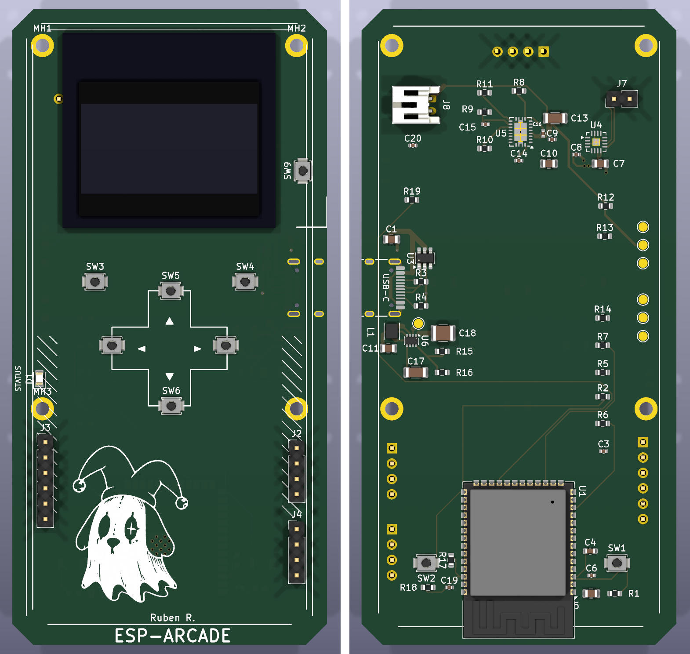
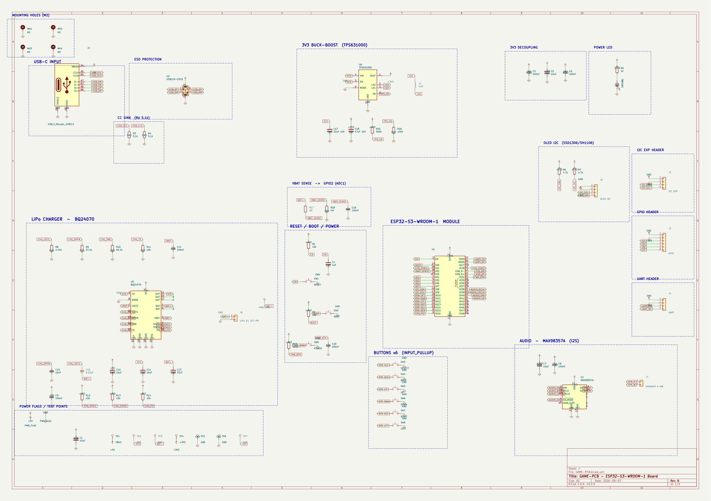

# ESP-ARCADE-32

Firmware modular para una consola portátil basada en ESP32, con pantalla OLED de 128 x 64, controles físicos, Wi-Fi y soporte para simulación en Wokwi.

El proyecto está organizado por capas para que los juegos, la interfaz y los servicios del sistema puedan evolucionar sin quedar acoplados al hardware.

## Estado del proyecto

| Área                                     | Estado                       |
| ---------------------------------------- | ---------------------------- |
| Snake                                    | Implementado                 |
| Pong                                     | Implementado                 |
| Flappy Bird                              | Implementado                 |
| Menú principal y navegación              | Implementado                 |
| Configuración Wi-Fi y almacenamiento NVS | Implementado                 |
| Teclado virtual                          | Implementado                 |
| OTA                                      | Integración en progreso      |
| Tetris                                   | Placeholder                  |
| Pantalla de información                  | Placeholder                  |
| PCB ESP-ARCADE Rev B                     | Diseño y routing en progreso |

> La aplicación que compila actualmente usa el pinout de ESP32 DevKit/Wokwi. El pinout de la PCB Rev B está documentado por separado y requiere una adaptación antes de usar el firmware en esa placa.

## Características

- Arquitectura por capas: drivers, servicios, core, UI y juegos.
- Compatible con controladores OLED SH1106 y SSD1306 mediante U8g2.
- Menú navegable con seis botones: OK, BACK, UP, DOWN, LEFT y RIGHT.
- Snake, Pong y Flappy Bird incluidos.
- Wi-Fi con escaneo de redes, conexión y credenciales persistentes en NVS.
- Teclado virtual para introducir contraseñas desde la consola.
- Servicios de red ejecutados en una tarea FreeRTOS independiente.
- Simulación reproducible con Wokwi.
- Dos entornos PlatformIO: ESP32-S3 DevKit C-1 y ESP32 DevKit C.

## Puesta en marcha

### Requisitos

- [PlatformIO](https://platformio.org/install/ide?install=vscode)
- Opcional: [Wokwi for VS Code](https://docs.wokwi.com/vscode/getting-started)

### Compilar y cargar

Desde la raíz del proyecto:

```bash
# ESP32-S3 DevKit C-1
pio run -e esp32-s3-devkitc-1
pio run -e esp32-s3-devkitc-1 -t upload

# ESP32 DevKit C / objetivo de Wokwi
pio run -e esp32dev
pio run -e esp32dev -t upload
```

Monitor serie:

```bash
pio device monitor -b 115200
```

Para usar Wokwi, compila primero el entorno `esp32dev`. El firmware y el ELF esperados son:

```text
.pio/build/esp32dev/firmware.bin
.pio/build/esp32dev/firmware.elf
```

El escenario incluido, `Menu Games Navigation`, está definido en [wokwi.toml](wokwi.toml).

## Controles y pantalla

### Pinout del firmware actual

| Función  | GPIO |
| -------- | ---: |
| OK       |    4 |
| BACK     |   19 |
| UP       |   17 |
| DOWN     |   32 |
| LEFT     |   12 |
| RIGHT    |   13 |
| OLED SDA |   21 |
| OLED SCL |   22 |
| OLED I2C | 0x3C |

La pantalla está configurada por defecto como SH1106 en [src/config/display_config.h](src/config/display_config.h). Para usar SSD1306, cambia `DISPLAY_CONTROLLER` en ese archivo.

### Navegación

- `UP` / `DOWN`: mover el cursor.
- `OK`: confirmar una opción.
- `BACK`: volver al menú anterior.
- `LEFT` / `RIGHT`: controles direccionales de los juegos y del teclado virtual.

## Arquitectura

```text
src/
├── main.cpp                 Entrada de la aplicación
├── config/                  Pines y configuración de pantalla
├── core/                    Máquina de estados del sistema
├── core0/services/          Wi-Fi y OTA
├── drivers/                 Display, botones y tiempo
├── games/                   Snake, Pong y Flappy Bird
├── ui/                      Menú, teclado y configuración
└── assets/                  Bitmaps y recursos gráficos
```

### Flujo de estados

```text
MENU
├── SNAKE
├── PONG
├── TETRIS (placeholder)
├── CONFIG
│   ├── WIFI_CONFIG
│   ├── UPDATE_CONFIG
│   └── INFO (placeholder)
└── BIRD
```

`SystemManager` coordina el estado actual, la entrada y el renderizado. Los juegos se actualizan desde el bucle principal y usan la capa de display en lugar de acceder directamente a U8g2.

## Juegos

### Snake

- Movimiento basado en una cuadrícula.
- Hasta 50 segmentos.
- Estados de inicio, partida, game over y reinicio.
- Comida generada en posiciones aleatorias.

### Pong

- Partida jugador contra IA.
- Física básica de la pelota y rebotes en los límites.
- Pantallas de victoria y derrota con bitmaps.

### Flappy Bird

- Gravedad y salto del pájaro.
- Tuberías con huecos aleatorios.
- Desplazamiento y detección de colisiones.

## Wi-Fi y OTA

`WiFiService` gestiona el escaneo, la conexión y la persistencia de SSID y contraseña mediante `Preferences`. La actividad de red se ejecuta en una tarea FreeRTOS separada para evitar bloquear la interfaz.

El flujo de configuración Wi-Fi es:

```text
SCANNING -> SELECT_NETWORK -> ENTER_PASSWORD -> CONNECTING
                                             └-> CONNECTION_FAILED
```

La integración OTA está preparada para consultar GitHub Releases y descargar firmware mediante `HTTPUpdate`. La pantalla y el flujo completo de actualización todavía están en desarrollo.

## Hardware

### Configuración de referencia

- ESP32 DevKit C o ESP32-S3 DevKit C-1.
- OLED I2C de 128 x 64, dirección `0x3C`.
- Seis botones con pull-up/pull-down según el montaje.
- Baudrate del monitor serie: `115200`.

### PCB ESP-ARCADE Rev B

La placa personalizada está diseñada alrededor de un ESP32-S3-WROOM-1 y mide 52 x 105 mm. Incluye:

- OLED I2C de 1.3 pulgadas.
- Batería LiPo 1S con BQ24070 y conector JST-PH.
- Regulador buck-boost TPS631000.
- Audio I2S con MAX98357A.
- USB-C con protección ESD.
- Conectores de expansión I2C, GPIO y UART.

#### Board Features

| Bloque              | Componente                                | Notas                                                                |
| ------------------- | ----------------------------------------- | -------------------------------------------------------------------- |
| MCU                 | ESP32-S3-WROOM-1                          | Wi-Fi y BLE, USB nativo, antena PCB en el borde                      |
| Entrada USB         | Conector USB-C + USBLC6-2SC6              | Resistencias de 5.1 kOhm en CC y protección ESD para D+/D-           |
| Batería             | BQ24070 + conector JST-PH                 | Cargador LiPo 1S con power-path; señales de estado conectadas al MCU |
| Alimentación 3V3    | TPS631000 + inductor de 1 uH              | Mantiene estable la alimentación mientras se descarga la batería     |
| Audio               | MAX98357A                                 | Amplificador clase D I2S con conector para altavoz                   |
| Pantalla            | OLED I2C de 1.3 pulgadas                  | Header de 4 pines con pull-ups de 4.7 kOhm                           |
| Controles           | 6 botones táctiles + RESET / BOOT / POWER | D-pad, SELECT y BACK                                                 |
| Medición de batería | Divisor de 1 MOhm / 1 MOhm                | `VBAT_SENSE` conectado a ADC1                                        |
| Expansión           | Headers I2C, GPIO y UART                  | Test points para VBUS, SYS, BAT+, 3V3, GND y LX2                     |

Pinout previsto para la PCB:

| Función    | GPIO | Función     | GPIO |
| ---------- | ---: | ----------- | ---: |
| BTN_UP     |   10 | OLED SDA    |    8 |
| BTN_DOWN   |   11 | OLED SCL    |    9 |
| BTN_LEFT   |   12 | I2S BCLK    |   38 |
| BTN_RIGHT  |   13 | I2S LRCLK   |   39 |
| BTN_SELECT |   14 | I2S DIN     |   40 |
| BTN_BACK   |   15 | Amp SD_MODE |   41 |
| POWER      |   21 | VBAT_SENSE  |    2 |

> Este pinout es el objetivo de la PCB, no la configuración activa del firmware. La migración también deberá incorporar audio y lectura de batería.

### Documentación visual

<p align="center">
  
</p>

<p align="center">
  
</p>

Estado de la placa: esquemático completado con ERC sin errores; colocación y stackup de cuatro capas definidos; routing todavía en progreso.

## Dependencias

Las dependencias se declaran en [platformio.ini](platformio.ini):

| Librería    | Versión    | Uso                                     |
| ----------- | ---------- | --------------------------------------- |
| U8g2        | `^2.35.19` | Driver de pantalla OLED                 |
| ArduinoJson | `^6.20.0`  | Procesamiento de respuestas JSON de OTA |

## Estructura de una nueva integración

Para añadir un juego:

1. Crea una carpeta en `src/games/<nombre>/`.
2. Añade la declaración y la lógica del juego.
3. Incorpora un nuevo estado en `SystemManager::State`.
4. Conecta el estado en el menú y en `SystemManager::update()`.
5. Compila ambos entornos antes de probarlo en hardware o Wokwi.

## Roadmap

- Completar el flujo de actualización OTA desde la UI.
- Implementar Tetris y la pantalla de información.
- Migrar la configuración de pines a la PCB Rev B.
- Añadir audio I2S y lectura del nivel de batería.
- Finalizar el routing y validar la PCB fabricada.
- Ampliar las pruebas automatizadas de menú y navegación.

## Licencia

Este repositorio no declara todavía una licencia. Añade una licencia antes de distribuir el firmware o reutilizarlo en otros proyectos.
